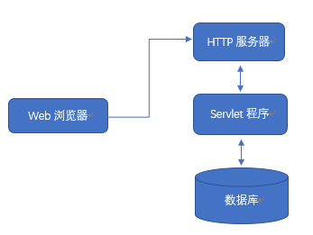

# Servlet

---

## Servlet 介绍

### Servlet 功能

Servlet 程序运行在服务器端，处理浏览器带来的 HTTP 请求，并返回响应给浏览器，实现用户交互。



相比于 CGI（公共网关接口），Servlet 有以下几点优势：

1. 性能明显更好。
2. 在 Web 服务器的地址空间内执行，不必单独创建进程来处理每个客户端请求。
3. 使用 Java 编写，平台无关性。
4. 进行了一系列限制，可以保护服务器计算机上的资源。

*目前主流框架的底层响应都以 Servlet 的方式实现。*

### Servlet 生命周期

- **加载和初始化**

服务器第一次访问 Servlet 时会创建 Servlet 的实例（一个 Servlet 类只有一个实例）。
  
之后服务器调用 `init` 方法初始化 Servlet 对象，创建或加载初始化数据。

- **处理服务**

每接收到一个 Http 请求时，服务器会产生一个新的线程并调用 `service` 方法处理请求。

- **销毁和垃圾回收**

当 Servlet 被销毁时，服务器调用 `destroy` 方法释放 Servlet 对象所占的资源。

最后由 JVM 对 Servlet 实例进行垃圾回收。

---

## Servlet 开发

### Servlet 接口

实现 Serlvet 接口，即可得到 Servlet 的 Java 类。Servlet 接口内定义了以下 5 个方法。

- **ServletRequest 类**：用户请求
- **ServletResponse 类**：返回信息

```java
public class ServletDemo1 implements Servlet {
    // 初始化
    public void init(ServletConfig arg0) throws ServletException {
        System.out.println("Init");
    }
    // 处理服务
    public void service(ServletRequest arg0, ServletResponse arg1)
            throws ServletException, IOException {
        System.out.println("Service");
    }
    // 销毁
    public void destroy() {
        System.out.println("Destroy");
    }
    // 获取 Servlet 配置
    public ServletConfig getServletConfig() {
        return null;
    }
    // 获取 Servlet 信息
   public String getServletInfo() {
        return null;
    }
}
```

### HttpServlet 类

在 Java EE 中， HttpServlet 类已经实现了 Servlet 接口。实际开发中我们可以直接使用。

HttpServlet 类中 service 方法会根据 HTTP 请求类型，选择调用 `doGet`、`doPost`、`doPut`，`doDelete` 等方法。

- **HttpServletRequest 类**：用户请求
- **HttpServletResponse 类**：服务器响应

```java
public class ServletDemo2 extends HttpServlet {
    // 接收 GET 请求
    @Override
    protected void doGet(HttpServletRequest req, HttpServletResponse resp)  throws ServletException, IOException {
        System.out.println("Get");
    }
    // 接收 POST 请求
    @Override
    protected void doPost(HttpServletRequest req, HttpServletResponse resp)  throws ServletException, IOException {
        System.out.println("Post");
        doGet(req,resp);
    }
}
```


---

Servlet 可以设置初始化参数，供Servlet内部使用。，在它初始化时调用init()方法，销毁时调用destroy()方法。Servlet需要在web.xml中配置（MyEclipse中创建Servlet会自动配置），一个Servlet可以设置多个URL访问。Servlet不是线程安全，因此要谨慎使用类变量。

创建 Serlvet 类后，我们在 web.xml 配置。

```xml
    <servlet>
        <!--创建的servlet 类名-->
        <servlet-name>default</servlet-name> 
        <!--创建的servlet 包名-->     
        <servlet-class>org.apache.catalina.servlets.DefaultServlet</servlet-class>  
        <!--初始化参数--> 
        <init-param>
            <param-name>debug</param-name>
            <param-value>0</param-value>          
        </init-param>                
            <load-on-startup>1</load-on-startup>
    </servlet>
    <!--建立映射：通过url访问servlet类--> 
    <servlet-mapping>                                  
        <servlet-name>default</servlet-name>
        <url-pattern>/</url-pattern>         
    </servlet-mapping>
```
