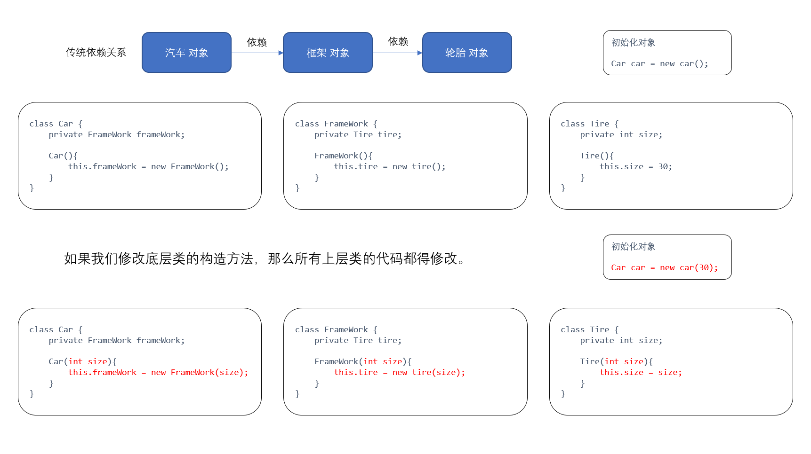
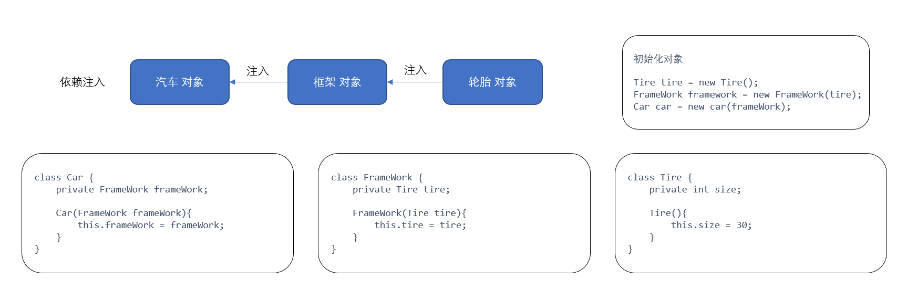

# Spring IOC

https://www.jianshu.com/p/ad05cfe7868e

---


## IOC 原理

### 代码耦合

实际开发中，我们如果在对象 A 内部去创建、修改或者注销另一个对象 B，这会导致对象之间非常复杂的依赖关系，不利于代码的维护更新。

比如我们直接在上层类内调用了底层类的构造方法，一旦底层类的构造方法发生改变，就必须修改所有上层类的代码。




### 依赖注入

( Dependency Injection ) 我们用依赖注入的方式来降低耦合度。所谓依赖注入，就是把底层对象作为参数传入上层对象。避免底层类被修改后上层类代码也要随之改动。我们一般通过构造方法或者 setter 方法注入底层对象。




优势：使用依赖注入后，即使底层类发生变化，上层类代码也不必改动，大大降低了代码的耦合度。

劣势：但这也导致了我们在初始化对象的过程中要书写复杂的代码。


### 控制反转

( Inversion of Control ) 控制反转，将对象的管理权交给 IOC 容器。

Spring 框架内会定义一个 IOC 容器类，通过其来统一管理对象的生命周期：创建、资源存取、注销；并自动维护对象间的依赖关系。用户只需要配置 XML 文件或者添加注解标明类之间的映射关系，初始化过程中的代码将由 IOC 容器自动完成。

IOC 容器底层通过工厂模式和 Java 反射机制来实现：

1. IOC 容器根据 XML 配置文件或者注解读取 Bean 中保存的对象信息。
2. IOC 容器充当工厂类，利用 Java 反射机制读取需要生成哪些对象，来自动生成相应的对象。

---

## 基础概念

### IOC 容器

在 Spring 框架中已经定义了 ApplicationContext 和 BeanFactory 作为 IOC 容器类。其中 ApplicationContext是 BeanFactory 的子类，提供了事件发布、国际化信息支持等其他高级特性。

我们可以通过 IOC 容器类的 setBean 方法创建 Bean ，也可以通过 getBean 方法把 Bean 实例化并使用。

```java
public void testUser(){
    // 加载配置文件，创建 IOC 容器对象
    ApplicationContext context = new ClassPathXmlApplicationContext("spring.xml");
    // IOC 容器根据 Bean 创建对象实例
    Person newUser = (Person) context.getBean("person");
    // 调用对象方法
    System.out.print(newUser.toString());
}
```

### Java Bean

Java Bean 就是程序中被管理的对象在 IOC 容器中的代理，记录了对象信息。

Bean 包含以下参数：Bean 名称(name) 、所代理的类(class) 、以及作用域(scope)。

#### Bean 的作用域

- **singleton 单例模式**（默认）： 在整个 IoC 容器中，Bean 只有一个对象实例。
- **prototype 原型模式**： 每次调用 Ioc 容器的 getBean 方法，都将产生一个新的对象实例。
- **request**： 对于每次 HTTP 请求，Bean 都将产生一个新的对象实例。
- **session**： 对于每个 HTTP Session，Bean 都将产生一个新的对象实例。
- **global session**： 对于每个全局的 HTTP Session，Bean 都将产生一个新的对象实例。

#### Bean 的生命周期


---


## IOC 注解详解

### 配置

为类添加 `@Configuration` 注解，表示该类为配置类。起到类似 XML 文件的作用，配置 IOC 容器用来管理 Bean。

#### 组件扫描

为配置类添加 `@ComponentScan` 注解，启用组件扫描。将根据注解向 IOC 容器添加 Bean，默认扫描本类中的 @Bean 方法。

可以指定需要扫描的包，这会扫描包内的所有组件。如 `@ComponentScan(value="com.company.project")`。


### 注册 (setBean)

为类添加 `@Component` 注解，表示该类型被注册为 Bean 。Bean 的名称默认为类名的首字母小写，作用域默认为单例模式。

1. 可以为注册的 Bean 指定名称，等同于 `@Component("car")` 。

2. 可以为注册的 Bean 指定作用域，如 `@Component("prototype")` 。

但 `@Component` 表示的含义太过笼统，一般不推荐使用。我们可以把注解细化为：

- `@Controller` 注解：表示展示层的 Bean
- `@Service` 注解：表示业务层的 Bean
- `@Repository` 注解：表示数据访问层的 Bean

```java
@Component
@Scope("prototype")
class Car implements Vehicle{
    @AutoWired
    private FrameWork frameWork;
}
```

还可以为方法添加 `@Bean` 注解，返回类型将被注册为 Bean。Bean 的名称默认为方法名，作用域默认为单例模式。

- 主要用在 @Configuration 注解的类里，也可以用在 @Component 注解的类里。

- 可以为注册的 Bean 指定名称，等同于 `@Bean(name = "myFoo")` 。


### 装配 (getBean)


为对象添加 `@Autowired` 注解，表示自动装配。在使用对象时 Spring 将**根据类型**自动查找 Bean 去创建对象，无法找到 Bean 则抛出异常。

1. 如果想要在无法找到 Bean 时返回 null 值，则将注解改为 `@Autowired(required=false)` 。

2. 如果自动装配对象的类型是接口，而配置的实现类 Bean 有多个。则必须用 `@Qualifier` 注解来指定 Bean 的名称。

```java
@Autowired
@Qualifier("car")
private Vehicle vehicle;
```


为对象添加 `@Resource` 注解，表示自动装配。默认按对象名称去查找 Bean，找不到再按类型去查找 Bean。

1. 注解可以指定按名称或者类型去查找 Bean，如 `@Resource(name="car")` 或者 `@Resource(type=Car.class)`。

2. 也可以同时按名称和类型查找 Bean，任何一个不匹配都将报错。

```java
@Resource(name="car")
private Vehicle vehicle;
```


> @Autowired 是 Spring 的注解，@Resource 是 J2EE 的注解。


