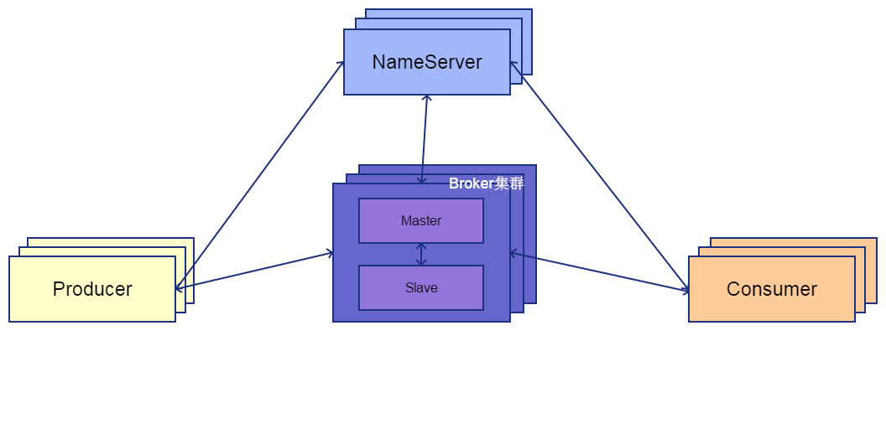
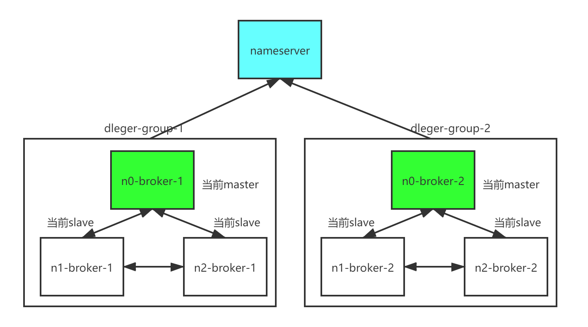
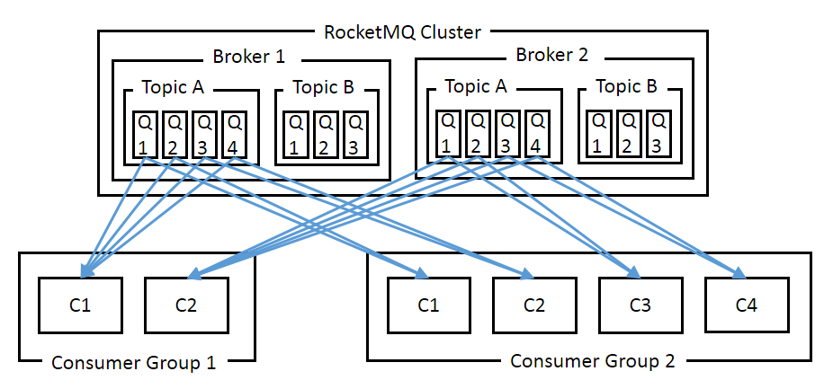

# Rocket MQ 

---

## Rocket MQ

### 基本介绍

阿里使用 Java 开发的开源消息中间件。适合处理高可靠性的数据，被广泛应用在订单，交易，充值，流计算，消息推送，日志流式处理，binglog 分发等场景。

- **优势**

无论是同步还是异步发送，生产者都会收到实时响应，因此可靠性能够得到保障。具备高吞吐量、高可用性、适合大规模分布式系统应用。


### 整体架构



- **NameServer**

所有机器定时向 NameServer 上报自己的状态（超时未发送被剔除），NameServer 内部通过 5 个 HashMap 保存全局信息，提供给其它机器查询。

NameServer 可以部署多个，相互独立。机器需同时向多个 NameServer 上报状态信息，从而达到热备份的目的。因为结构简单，无需使用专门的 zookeeper 注册中心来提供协调服务。

- **ProduceGroup & ConsumerGroup**

在 RMQ 中消息的生产和消费都通过 Group 完成，一个 Group 内可包含多个实例（进程）。发送分布式事务消息时，如果 Producer 中途意外宕机，Broker 会主动回调 Producer Group 内的任意一台机器来确认事务状态。

- **Tag**

在 Topic 下对消息按逻辑做进一步的细分，消费者可以订阅指定的 Tag。常用于区分同一个应用下不同的业务或场景。

- **Message Queue**

消息物理管理单位。一个 Topic 将有若干个 Q 。Q 可以存储落在不同 Broker 的结点上，具有水平扩展的能力。


### 多副本模式



- **Dleger**

保障在线系统的可靠性和可用性的基本手段是多副本和主-从两种方案。RMQ 采用多副本模式，将集群分为多个 dleger-group ，每个 group 由 3 台或以上 broker 组成。默认使用同步复制同步刷盘，master 要将消息同步到 slave 才会返回成功，保证 master-slave 的 commitlog 一致性。

定时线程会检测各 broker 状态，当前 master 挂掉后，会触发自动选主保证集群的读写能力不受影响。选主基于 raft 协议，默认会选择 offset 较大的 slave 为主节点，防止消息丢失。

### 消费模型



消费模型和 kafka 类似。Consumer 获取消息后，只有在消息消费完成时才会向服务器返回 ack 。如果没有消费完成，则一定不会 ack 消息。

---

## Java 操作 RMQ

### 导入依赖

```xml
<dependency>
    <groupId>org.apache.rocketmq</groupId>
    <artifactId>rocketmq-client</artifactId>
    <version>4.3.1</version>
</dependency>
```

### 生产者

生产者生产消息通常分为同步生产和异步生产两种方式：

1. **同步生产 SYNC**

可靠性最强，但性能最低的发送方式。应用在发送消息后将等待返回值，再进行之后的处理。

常用于重要通知邮件、报名短信通知、营销短信系统等。

```java
public class JavaProducerExampleRMQ {

    public static void main(String[] args) throws Exception {

        // 设定生产者
        DefaultMQProducer producer = new DefaultMQProducer("PG-producer_test");               // 设定生产组名
        producer.setNamesrvAddr("nameServer_1:9876;nameServer_2:9876");                       // 设定 NameServer 地址
        producer.setToken("token");                                                           // 设定 Token
        producer.start();

        // 消息设定
        List<Message> messageList = new ArrayList<>();
        for (int i = 0; i < 50; i++) {
            Message msg = new Message("stream_rmq_topic" ,                                    // 设定 Topic 
                    "test",                                                                   // 设定 Tag（可选）
                    "20200727",                                                               // 设定 Key ，用于消息查询（可选）
                    ("Hello RocketMQ " + i).getBytes("UTF-8")                                 // 设定 Message body 
            );
            // 可以设定消息延迟发送，如超时未支付关闭订单
            // Level 从 1 - 18 依次为 1s 5s 10s 30s 1m 2m 3m 4m 5m 6m 7m 8m 9m 10m 20m 30m 1h 2h
            message.setDelayTimeLevel(2);                   
            messageList.add(msg);
        }

        // 发送消息并接收结果
        SendResult sendResult = producer.send(messageList);
        System.out.printf("%s%n", sendResult);
        producer.shutdown();
    }
}
```

通过阅读 DefaultMQProducer 接口源码，可以了解相关配置。

```java
    public DefaultMQProducer(String producerGroup) {
        this(producerGroup, (RPCHook)null);
    }

    public DefaultMQProducer(String producerGroup, RPCHook rpcHook) {
        // topic key
        this.createTopicKey = "TBW102";
        // topic 下队列数量
        this.defaultTopicQueueNums = 4;
        // 发送超时时间
        this.sendMsgTimeout = 3000;
        // 超出 4096 字节压缩
        this.compressMsgBodyOverHowmuch = 4096;
        // 重发限制（同步时有效）
        this.retryTimesWhenSendFailed = 2;
        this.retryTimesWhenSendAsyncFailed = 2;
        this.retryAnotherBrokerWhenNotStoreOK = false;
        // 最大消息尺寸(128k)
        this.maxMessageSize = 4194304;
        // 生产组
        this.producerGroup = producerGroup;
        this.groupName = producerGroup;
        // 实现类，负责具体功能实现
        this.defaultMQProducerImpl = new DefaultMQProducerImpl(this, rpcHook);
    }
```

2. **异步生产 ASYNC**

如果希望获取更好的性能，可以通过异步实现高并发。应用将不再等待返回值，而是通过回调触发相对应的业务。异步生产一旦发送失败，将不支持重试。且不保证消息发送严格有序。

可用于注册成功后通知积分系统发放优惠券。


```java
public class AsyncProducer {
    public static void main(String[] args) throws Exception {
        DefaultMQProducer producer = new DefaultMQProducer("ProducerGroupName");
        producer.setNamesrvAddr("127.0.0.1:9876");
        producer.setToken(""); 
        producer.start();

        Message msg = new Message("TopicTest"
            "TagA",
            "ORDER-20170101-XXX", 
            ("Hello RocketMQ").getBytes("UTF-8")
        );

        // 异步生产，发送但没有返回值，需要在回调函数上做业务处理
        producer.send(msg, new SendCallback() {
            @Override
            public void onSuccess(SendResult sendResult) {
                System.out.printf(sendResult.getMsgId());
            }
            @Override
            public void onException(Throwable e) {
                e.printStackTrace();
            }
        });

        producer.shutdown();
    }
}
```


3. **一次发送 ONEWAY**

如果对于性能十分敏感，且不需要消息回复。可以发送单向消息而不返回任何结果，不能保障可靠性。


```java
public class OnewayProducer {
   public static void main(String[] args) throws Exception {

       DefaultMQProducer producer = new DefaultMQProducer("producer_group");
       producer.setNamesrvAddr("localhost:9876");
       producer.start();

       for (int i = 0; i < 100; i++) {
           Message msg = new Message("topicList", "tag", ("rocketMQ" + i).getBytes(RemotingHelper.DEFAULT_CHARSET));
           // 发送单向消息，没有返回值
           producer.sendOneway(msg);
       }

       producer.shutdown();

   }
}
```


### 消费者

MQConsumer 接口下实现了两类消费者：
 
1. **DefaultMQPushConsumer 接口**

应用向 Consumer 对象注册一个 Listener 接口，收到消息后 Consumer 对象立刻回调 Listener 接口方法。

```java
public class JavaConsumerExampleRMQ {

    public static void main(String[] args) throws Exception {

        // 设定消费者
        DefaultMQPushConsumer consumer = new DefaultMQPushConsumer("CG-consumer_test");         // 设定消费组名
        consumer.setNamesrvAddr("nameServer:9876;nameServer_2:9876");                           // 设定 NameServer 地址
        consumer.setToken("Token");                                                             // 设定 Token
        consumer.setConsumeFromWhere(ConsumeFromWhere.CONSUME_FROM_FIRST_OFFSET);               // 设定从最开始处消费
        consumer.setConsumeMessageBatchMaxSize(10);                                             // 设定线程最大消费数量，默认为 1 （50 条消息将分给 5 个线程处理）
        consumer.subscribe("stream_rmq_topic", "test");                                         // 设定订阅的 topic 和 tag（ * 表示全部）

        // 注册消息监听，输入参数类型
        // 1. MessageListenerConcurrently 接口：只保证一组消息被顺序消费，性能更好
        // 2. MessageListenerOrderly 接口：消息严格按顺序消费 
        consumer.registerMessageListener(new MessageListenerConcurrently() {
            @Override
            public ConsumeConcurrentlyStatus consumeMessage(List<MessageExt> msgs, ConsumeConcurrentlyContext context) {
                for (MessageExt msg : msgs) {
                    try {
                        System.out.println(Thread.currentThread().getName() + " Receive New Messages: " + new String(msg.getBody()));
                    }catch (Throwable throwable){
                        System.out.println("exception happened");
                        logger.error("failed to process,msg:{}",msg,throwable);
                    }
                }
                // 返回成功，消息会被ACK
                return ConsumeConcurrentlyStatus.CONSUME_SUCCESS;
            }
        });
        
        // 启动订阅
        consumer.start();
        System.out.printf("Consumer Started.%n");
    }
}
```


通过阅读 DefaultMQPushConsumer 接口源码，可以了解相关配置。

```java
/* DefaultMQPushConsumer 类默认配置（源码） */

public DefaultMQPushConsumer(String consumerGroup) {
    this(consumerGroup, (RPCHook)null, new AllocateMessageQueueAveragely());
}

public DefaultMQPushConsumer(String consumerGroup, RPCHook rpcHook, AllocateMessageQueueStrategy allocateMessageQueueStrategy) {
    // 消费方式： 
    // 1. CLUSTERING 集群，组内所有消费者平均消费一组消息
    // 2. BROADCASTING 广播，组内所有消费者消费同样的消息
    this.messageModel = MessageModel.CLUSTERING;           
    // 消费者开始消费的位置：
    // 1. CONSUME_FROM_LAST_OFFSET：第一次启动从队列最后位置消费
    // 2. CONSUME_FROM_FIRST_OFFSET：第一次启动从队列初始位置消费
    // 3. CONSUME_FROM_TIMESTAMP：第一次启动从指定时间点位置消费
    this.consumeFromWhere = ConsumeFromWhere.CONSUME_FROM_LAST_OFFSET;
    // 时间戳
    this.consumeTimestamp = UtilAll.timeMillisToHumanString3(System.currentTimeMillis() - 1800000L);
    // 订阅 topic & tag
    this.subscription = new HashMap();
    // 线程池
    this.consumeThreadMin = 20;
    this.consumeThreadMax = 64;
    this.adjustThreadPoolNumsThreshold = 100000L;
    // 流量控制                             
    this.consumeConcurrentlyMaxSpan = 2000;                     // 单队列并行消费最大跨度
    this.pullThresholdForQueue = 1000;                          // 单队列最大消费消息个数
    this.pullThresholdSizeForQueue = 100;
    this.pullThresholdForTopic = -1;
    this.pullThresholdSizeForTopic = -1;
    this.pullInterval = 0L;                                     // 消息拉取时间间隔
    this.consumeMessageBatchMaxSize = 1;                        // 单线程最大处理个数（消息数量过多将调用多个线程处理）
    this.pullBatchSize = 32;                                    // 消费单次拉取数量
    this.postSubscriptionWhenPull = false;
    this.unitMode = false;
    this.maxReconsumeTimes = -1;
    this.suspendCurrentQueueTimeMillis = 1000L;
    this.consumeTimeout = 15L;
    // 消费组
    this.consumerGroup = consumerGroup;
    this.groupName = consumerGroup;
    // 集群模式下消息分配策略，默认平均分配
    this.allocateMessageQueueStrategy = allocateMessageQueueStrategy;
    // 实现类，负责具体功能实现
    this.defaultMQPushConsumerImpl = new DefaultMQPushConsumerImpl(this, rpcHook);
    this.asyncTrackReporter = new AsyncTrackReporter();
}
```

拉取消息实际是调用 DefaultMQPushConsumerImpl 类下的 pullMessage 方法进行消息的拉取。

> 参考资料
> 1. 参数：https://blog.csdn.net/a417930422/article/details/50700281
> 2. 过程：https://blog.csdn.net/meilong_whpu/article/details/77076298

2. **DefaultMQPullConsumer 接口**

应用主动调用 Consumer 的 pull 方法从 Broker 获取消息。需要自己维护 MessageQueue 与 Offset ，建议只有必要时使用。

```java
public class PullConsumer {
    private static final Map<MessageQueue, Long> OFFSET_TABLE = new HashMap<MessageQueue, Long>();

    public static void main(String[] args) throws MQClientException {
        DefaultMQPullConsumer consumer = new DefaultMQPullConsumer("ConsumerGroupName");

        consumer.start();

        Set<MessageQueue> mqs = consumer.fetchSubscribeMessageQueues("TopicTest");
        for (MessageQueue mq : mqs) {
            System.out.println("Consume from the queue: " + mq);
            SINGLE_MQ:
            while (true) {
                try {
                    PullResult pullResult =
                        consumer.pullBlockIfNotFound(mq, null, getMessageQueueOffset(mq), 32);
                    System.out.println("Result: " + pullResult);
                    putMessageQueueOffset(mq, pullResult.getNextBeginOffset());
                    switch (pullResult.getPullStatus()) {
                        case FOUND:
                            break;
                        case NO_MATCHED_MSG:
                            break;
                        case NO_NEW_MSG:
                            break SINGLE_MQ;
                        case OFFSET_ILLEGAL:
                            break;
                        default:
                            break;
                    }
                } catch (Exception e) {
                    e.printStackTrace();
                }
            }
        }

        consumer.shutdown();
    }

    private static long getMessageQueueOffset(MessageQueue mq) {
        Long offset = OFFSET_TABLE.get(mq);
        if (offset != null)
            return offset;

        return 0;
    }

    private static void putMessageQueueOffset(MessageQueue mq, long offset) {
        OFFSET_TABLE.put(mq, offset);
    }
}
```