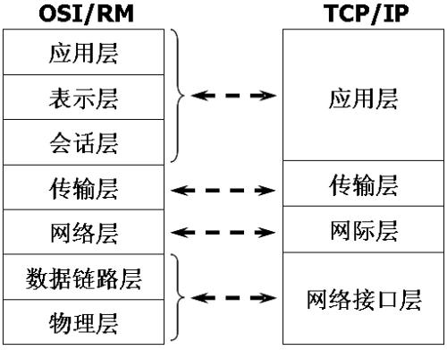

# 计算机网络

---

## 体系结构

在 OSI 和 TCP/IP 体系结构中，计算机网络被划分为多层。每层执行自己的功能，由下层向上层提供接口。

### 应用层

负责特定应用进程间的数据交互，来完成特定的网络应用。

常用的应用层协议有：

- **域名系统 DNS**：将域名和 IP 地址相互映射，使用户能够通过域名访问互联网。

- **超文本传输协议 HTTP**：发布和接收 HTML 页面，使用户能够通过浏览器浏览网页，默认端口 80。

- **电子邮件协议 SMTP**：发布和接收邮件。

### 运输层

将应用层的报文封装到传输层中，根据套接字（IP 地址 + 端口）建立两台主机进程之间的端对端通信。

（分用和复用）多个应用层进程可同时使用下层的运输层服务，到达后运输层把收到的信息分别交付上面应用层中的相应进程。

运输层主要使用以下两种协议:

- **传输控制协议 TCP**：提供面向连接的，可靠的数据传输服务。
  
- **用户数据协议 UDP**：提供无连接的，尽最大努力的数据传输服务（不保证数据传输的可靠性）。

### 网络层

把运输层的报文分组封装成 IP 数据报，根据 IP 地址在网络中选择合适的路由传输。

### 数据链路层

将网络层交下来的 IP 数据报组装成帧，根据 MAC 地址建立网络中两个相邻节点间的点对点传输。同时也会对传输帧进行基本的差错检测。

在接收数据时，控制信息使接收端能够知道一个帧从哪个比特开始和到哪个比特结束。这样，数据链路层在收到一个帧后，就可从中提出数据部分，上交给网络层。 控制信息还使接收端能够检测到所收到的帧中有误差错。如果发现差错，数据链路层就简单地丢弃这个出了差错的帧，以避免继续在网络中传送下去白白浪费网络资源。如果需要改正数据在链路层传输时出现差错（这就是说，数据链路层不仅要检错，而且还要纠错），那么就要采用可靠性传输协议来纠正出现的差错。这种方法会使链路层的协议复杂些。

### 物理层

实现相邻计算机节点之间比特流的透明传送，尽可能屏蔽掉具体传输介质和物理设备的差异。

---

## TCP 协议

###  TCP 和 UDP 的区别

**UDP 提供不可靠但高效的、无连接的服务**：在传送数据之前不需要建立连接，远地主机在收到 UDP 报文后也不需要给出任何确认。

一般用于即时通信，如语音、视频、直播等场景。

**TCP 提供可靠的、面向连接的服务**：在传送数据之前必须先建立连接，数据传送结束后要释放连接。传输过程中会校验数据，保证可靠性。

一般用于文件传输、发送和接收邮件、远程登录等场景。

### TCP 建立连接

#### 建立连接

建立 TCP 协议采用了三次握手策略：SYN 是 TCP/IP 建立连接时使用的握手信号，接收者到后以 ACK 信号响应（序号加一）。

1. 客户端向服务端 发送带有 SYN 标志的数据包（客户端请求连接）
2. 服务端向客户端 发送带有 SYN/ACK 标志的数据包（客户端可以正常发送消息）
3. 客户端向服务端 发送带有带有 ACK 标志的数据包（服务端可以正常发送消息，连接建立）

#### 断开连接

断开 TCP 连接采用了四次挥手策略：FIN 是 TCP/IP 断开连接时使用的终止信号，接收者到后以 ACK 信号响应（序号加一）。

1. 客户端向服务端 发送带有 FIN 标志的数据包（客户端请求终止）
2. 服务器向客户端 发送带有 ACK 标志的数据包（客户端不再发送消息，连接半关闭）
3. 服务器向客户端 发送带有 FIN 标志的数据包（服务端请求终止）
4. 客户端向服务端 发送带有 ACK 标志的数据包（服务端不再发送消息，连接关闭）

### TCP 可靠传输

#### 编号和校验和

- **编号**

发送方将应用报文分割成 TCP 报文段后，会为每一个报文段进行编号。由接收方对数据包进行排序，再把有序数据传送给应用层。

如果收到重复报文段，直接丢弃。

- **校验和**

发送方会计算 TCP 报文段全部数据的检验和，并保存在报文段首部。由接收方对数据包数据进行检验。

如果收到错误报文段，丢弃报文段，并返回错误消息等待重发。

**ARQ 协议**

（自动重传请求）发送方发送报文段后，会等待接收方 ACK。如果接收到错误消息或等待超时，将重发这个报文段。用来实现可靠传输。

现在一般使用连续 ARQ 协议：维持一个发送窗口，可以连续发送出去多个报文段而不需要等待对方确认。接收方对按序到达的最后一个报文段发送确认，即表明之前的所有报文段都已经正确收到。提高信道利用率。

*如果发送方连续发送了 5 条消息，其中 3 号消息丢失。接收方只会对前两个消息发送确认。发送方必须对后三条消息全部重传。*

#### 流量控制和阻塞控制

- **流量控制**：减少数据发送，防止接收方过载导致数据无法处理。

- **拥塞控制**： 减少数据发送，防止网络阻塞导致数据无法到达。

发送方允许连续发送的分组上限受以上两个因素制约，即 `发送窗口 = min (接收窗口, 阻塞窗口)`。

1. 接收窗口大小由 接收方返回的确认报文中的窗口字段设定。

2. 拥塞窗口大小根据网络的拥塞程度动态变化，TCP 拥塞窗口变化采取了慢开始、拥塞避免、快重传 和 快恢复 四种策略。

